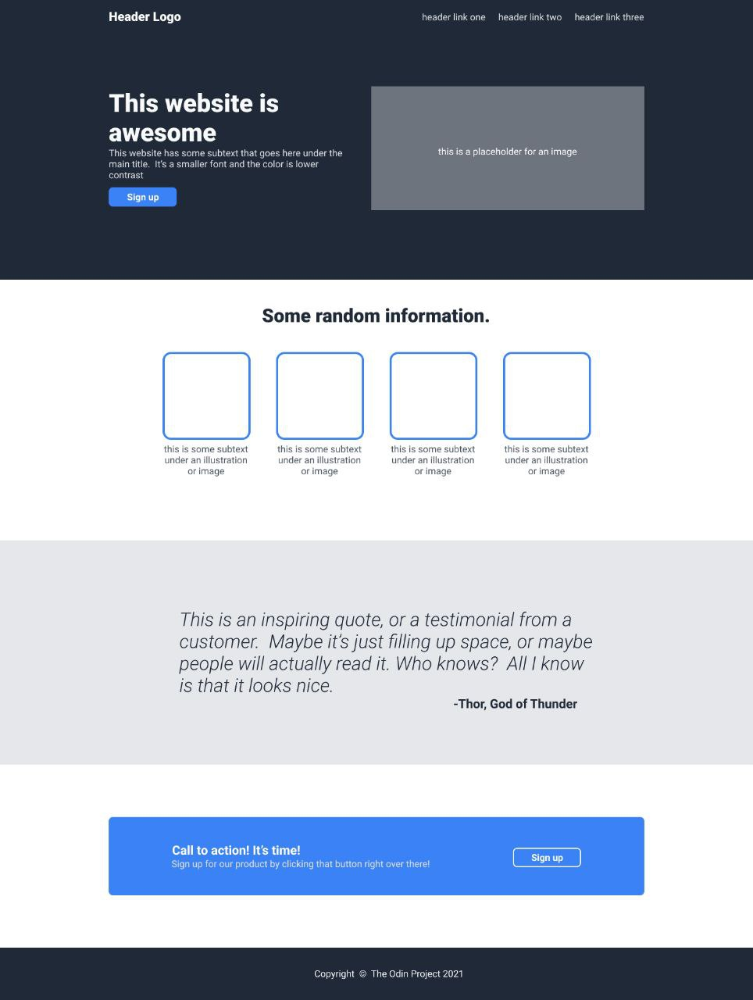
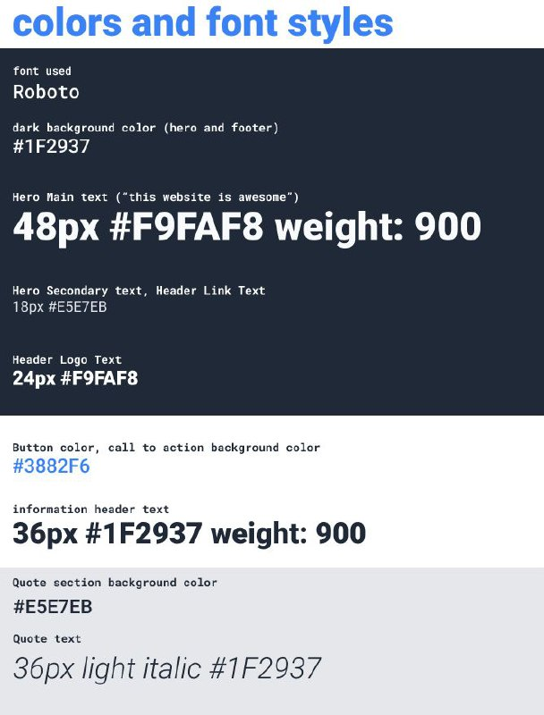

## Bahasa Indonesia

Repositori ini berisi solusi saya untuk tugas "Landing Page" dari The Odin Project. Tujuan dari proyek ini adalah untuk membangun halaman web lengkap dari desain yang diberikan, dengan fokus pada struktur HTML, styling CSS (termasuk Flexbox), dan praktik terbaik dalam pengembangan web.

### Daftar Isi

- [Ikhtisar](#ikhtisar)

  - [Tantangan](#tantangan)

  - [Desain Layout](#design-layout)

  - [Tautan](#tautan)

- [Proses Saya](#proses-saya)

  - [Dibangun Dengan](#dibangun-dengan)

  - [Apa yang Saya Pelajari](#apa-yang-saya-pelajari)

  - [Pengembangan Lanjutan](#pengembangan-lanjutan)

- [Penulis](#penulis)

- [Ucapan Terima Kasih](#ucapan-terima-kasih)

## Ikhtisar

### Tantangan

Pengguna diharapkan dapat:

- Membuat situs berdasarkan gambar desain yang disediakan.

- Membuat halaman web yang sepenuhnya terstruktur dan diberi gaya menggunakan HTML dan CSS.

Proyek ini menekankan:

- Membangun bagian demi bagian, dimulai dengan HTML kemudian CSS.

- Memanfaatkan Flexbox untuk tata letak.

- Mengimplementasikan konsep dasar CSS seperti `margin`, `padding`, `box-sizing`, dan integrasi font eksternal.

- Mempraktikkan alur kerja Git dan GitHub yang baik (melakukan commit lebih awal & sering).

- Tidak khawatir tentang kesempurnaan piksel atau responsivitas seluler pada tahap ini.

### Desain Layout

### Tautan

- URL Solusi:(https://github.com/bRezha/TOP_Landing-Page)

- URL Situs Langsung:(https://brezha.github.io/TOP_Landing-Page/)

## Proses Saya

Proyek ini didekati dengan memecah desain menjadi bagian-bagian yang berbeda (Header, Hero, dll.) dan membangunnya secara berurutan. Untuk setiap bagian, saya berfokus pada penyelesaian konten HTML terlebih dahulu, diikuti dengan styling CSS yang sesuai.

### Dibangun Dengan

- **HTML5:** Untuk struktur halaman.

- **CSS3:** Untuk semua styling, termasuk:

  - Flexbox untuk tata letak.

  - Reset CSS Universal (`margin: 0; padding: 0; box-sizing: border-box;`).

  - Google Fonts (Roboto).

- **Git & GitHub:** Untuk kontrol versi dan hosting proyek.

- **VS Code:** Sebagai lingkungan pengembangan.

### Apa yang Saya Pelajari

Selama proyek ini, saya memperkuat pemahaman saya tentang:

- Menyiapkan fondasi proyek yang kuat dengan  reset CSS  dan `box-sizing: border-box`.

- Mengintegrasikan font eksternal (Google Fonts) ke dalam halaman web.

- Membangun tata letak kompleks menggunakan Flexbox, mengelola spasi dengan `justify-content` dan `align-items`.

- Menstrukturkan halaman web secara logis berdasarkan desain visual.

- Pentingnya melakukan commit lebih awal dan sering dengan pesan commit yang jelas dan deskriptif.

- Alur kerja mendorong perubahan lokal ke repositori GitHub jarak jauh.

### Pengembangan Lanjutan

Dalam proyek-proyek di masa mendatang, saya bertujuan untuk fokus pada:

- Meningkatkan responsivitas untuk berbagai ukuran layar (mobile-first approach).

- Menjelajahi properti dan selektor CSS yang lebih canggih.

- Berpotensi menambahkan elemen interaktif menggunakan JavaScript (setelah saya mempelajari dasarnya).

## Penulis

- Rezha Bayu

- GitHub    - (https://github.com/bRezha)

## Ucapan Terima Kasih

- Proyek ini diselesaikan sebagai bagian dari kurikulum [The Odin Project](https://www.theodinproject.com/).

